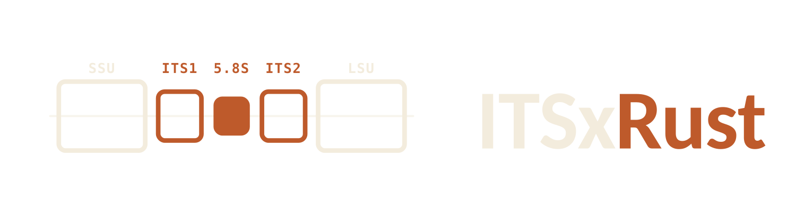

<p align="center">
  <picture>
    <source media="(prefers-color-scheme: dark)" srcset="assets/itsxrust-logo-dark.png">
    
  </picture>
</p>

---
<br>

<p align="left">
  <a href="https://bioconda.github.io/recipes/itsxrust/README.html"></a>
  <a href="https://anaconda.org/bioconda/itsxrust"></a>
  <a href="https://github.com/ayobi/ITSxRust/pkgs/container/itsxrust"></a>
  <a href="https://github.com/ayobi/ITSxRust/releases"></a>
  <a href="https://github.com/ayobi/ITSxRust/actions"></a>
  <a href="LICENSE"></a>
  <a href="https://doi.org/10.64898/2026.02.25.707950"></a>
  <a href="https://nf-co.re/ampliseq"></a>
</p>

ITS subregion extraction for fungal metabarcoding at long-read scale.

As long-read amplicon sequencing (Oxford Nanopore and PacBio HiFi) becomes routine, extracting ITS subregions (ITS1, 5.8S, ITS2, full ITS) reliably at scale can become a throughput and robustness bottleneck. ITSxRust is a Rust-based ITS extractor that follows the standard approach of locating conserved ribosomal flanks using profile-HMMs (via HMMER), while adding long-read–oriented features for reproducible, high-throughput processing.

## Integration

ITSxRust is integrated into [nf-core/ampliseq](https://nf-co.re/ampliseq) (v2.17.0+) as an alternative ITS extractor alongside [ITSx](https://microbiology.se/software/itsx/). Enable it with:

```bash
nextflow run nf-core/ampliseq -profile <docker/singularity/conda> \
  --its_extractor itsxrust \
  ...
```

See the [ampliseq documentation](https://nf-co.re/ampliseq) for the full parameter list.

## Features

- **HMMER-based boundary detection** — locates conserved ribosomal flanks (SSU, 5.8S, LSU) using `nhmmer` profile-HMM searches to delimit ITS subregions
- **Platform presets** — `--preset ont` (tolerant E-values, wider length constraints) and `--preset hifi` (strict thresholds); explicit flags override any preset value
- **Partial-chain fallback** — when the full 4-anchor chain (SSU→5.8S_start→5.8S_end→LSU) is unavailable, recovers subregions from 2-anchor pairs (e.g., SSU+5.8S_start for ITS1)
- **Confidence classification** — each extracted read is labelled `confident`, `ambiguous`, or `partial` based on per-anchor score/E-value thresholds; ambiguous reads can be diverted to a separate file with `--write-ambiguous`
- **Exact dereplication** — `--derep` hashes identical sequences and searches only unique representatives, projecting results back to duplicates
- **Structured QC output** — `--qc-json` emits a per-sample JSON summary (read counts, skip-reason breakdown, parameters) suitable for MultiQC ingestion; `--anchors-tsv` / `--anchors-jsonl` export per-read anchor coordinates and confidence labels
- **Multi-region output** — extract ITS1, ITS2, full ITS, all three simultaneously (`--region all`), or the flanking SSU/LSU portions captured in the read (`--region ssu` / `--region lsu`, requires a full 4-anchor chain)
- **FASTA and FASTQ support** — reads gzipped or uncompressed inputs; preserves quality scores when outputting FASTQ

## Quick start

```bash
itsxrust extract \
  --input reads.fastq.gz \
  --hmm F.hmm \
  --output its2_extracted.fasta \
  --region its2 \
  --preset ont \
  --hmmer-cpu 8
```

To extract ITS1, ITS2, and full ITS simultaneously, use `--region all`. In this mode, `--output` is treated as a prefix:

```bash
itsxrust extract \
  --input reads.fastq.gz \
  --hmm F.hmm \
  --output results/sample1 \
  --region all \
  --preset ont \
  --hmmer-cpu 8
```

This produces `results/sample1.its1.fasta`, `results/sample1.its2.fasta`, and `results/sample1.full.fasta`.

### SSU / LSU export

For long reads that span the full operon (SSU → ITS1 → 5.8S → ITS2 → LSU), the conserved flanks captured upstream and downstream of the ITS region can be exported with `--region ssu` and `--region lsu`:

```bash
itsxrust extract \
  --input reads.fastq.gz \
  --hmm F.hmm \
  --output ssu.fasta \
  --region ssu \
  --preset ont
```

The output is the portion of the SSU/LSU gene **captured in the read, bounded by the conserved HMM anchor** — substantial on a full-operon long read, a sliver on a short ITS amplicon — not a curated 18S/28S gene. Both regions require a successful full 4-anchor chain; there is no partial-chain fallback for the flanks.

By construction, `SSU ++ FULL ++ LSU` reconstructs the original read (or its reverse complement, for minus-strand reads), which is what the integration test suite verifies.

## Install

### Bioconda (recommended)

ITSxRust is available on [Bioconda](https://bioconda.github.io/). This is the easiest way to install, as it also handles the HMMER dependency:

```bash
conda install -c bioconda -c conda-forge itsxrust
```

### Prebuilt binaries

Download the binary for your platform from [GitHub Releases](https://github.com/ayobi/ITSxRust/releases), then:

```bash
chmod +x itsxrust
./itsxrust --help
```

### Docker

The Docker image bundles HMMER, so `nhmmer` is available out of the box:

```bash
docker run --rm -v $(pwd):/data ghcr.io/ayobi/itsxrust:latest \
  extract --input /data/reads.fastq.gz --hmm /data/F.hmm \
  --output /data/its2_extracted.fasta --region its2 --preset ont
```

### From source

Requires Rust (stable, edition 2024) and Cargo:

```bash
cargo install --path .
itsxrust --help
```

### Dependency: HMMER

ITSxRust calls `nhmmer` to search profile-HMMs against input sequences. Install HMMER 3.x and ensure `nhmmer` is on your PATH:

```bash
conda install -c bioconda hmmer
```

> **Note:** If you installed via Bioconda or Docker, HMMER is already included — no separate installation is needed.

### HMM profiles

ITSxRust uses the same fungal HMM profiles as [ITSx](https://microbiology.se/software/itsx/). The file is typically called `F.hmm` (for fungi) and is distributed with ITSx. After installing ITSx, find it with:

```bash
find $(dirname $(which ITSx))/../ -name "F.hmm" 2>/dev/null
```

Or download the ITSx package and extract the HMM files from the `ITSx_db/HMMs/` directory.

## Usage

```bash
itsxrust --help
itsxrust extract --help
```

### Key options

| Flag | Description | Default |
|---|---|---|
| `--input` | Input FASTA/FASTQ (`.gz` OK) | required |
| `--hmm` | HMM profile file | required (unless `--tblout-existing`) |
| `--output` | Output file (single region) or prefix (`--region all`) | required |
| `--region` | `its1`, `its2`, `full`, `ssu`, `lsu`, or `all` | `full` |
| `--preset` | `ont` or `hifi` — sets E-value, constraints, confidence thresholds | — |
| `--hmmer-cpu` | Threads for nhmmer | 8 |
| `--inc-e` | E-value inclusion threshold | 1e-5 (ont: 1e-3, hifi: 1e-10) |
| `--derep` | Exact dereplication before HMMER search | false |
| `--input-format` | `auto`, `fasta`, or `fastq` | `auto` |
| `--output-format` | `auto`, `fasta`, or `fastq` | `auto` |
| `--tblout-existing` | Reuse a previous nhmmer `--tblout` file (skips nhmmer) | — |
| `--anchors-tsv` | Write per-read anchor coordinates as TSV | — |
| `--anchors-jsonl` | Write per-read anchor coordinates as JSONL | — |
| `--qc-json` | Write per-sample QC summary as JSON | — |
| `--write-ambiguous` | Divert ambiguous reads to a separate file | — |
| `--write-skipped` | Write skipped reads to a separate file | — |
| `--explain N` | Print skip reasons for the first N skipped reads | 0 |

### Platform presets

Presets bundle sensible defaults for each platform. Explicit flags always override preset values.

| Parameter | No preset | `--preset ont` | `--preset hifi` |
|---|---|---|---|
| `--inc-e` | 1e-5 | 1e-3 | 1e-10 |
| `--max-per-anchor` | 8 | 10 | 6 |
| `--min-its1` / `--max-its1` | 50 / 1500 | 30 / 1800 | 50 / 1500 |
| `--min-its2` / `--max-its2` | 50 / 2000 | 30 / 2500 | 50 / 2000 |
| `--min-full` / `--max-full` | 150 / 4000 | 100 / 5000 | 150 / 4000 |
| `--min-anchor-score` | 20 | 15 | 30 |
| `--max-anchor-evalue` | 1e-4 | 1e-3 | 1e-8 |

### Diagnostics

Use `--explain` to see why reads are being skipped:

```bash
itsxrust extract --input reads.fq --hmm F.hmm --output out.fasta \
  --region full --explain 10
```

```
SKIP read_42: missing anchors: LSU_start
SKIP read_87: anchors present but no valid chain under constraints
```

Use `--qc-json` for a machine-readable summary of the full run:

```bash
itsxrust extract --input reads.fq --hmm F.hmm --output out.fasta \
  --region all --preset ont --qc-json qc_summary.json
```

The JSON includes total reads, kept/skipped counts with reason-code breakdowns, confidence classification counts, dereplication stats (if `--derep`), and the effective parameters used.

Use `--anchors-tsv` or `--anchors-jsonl` to export per-read anchor hit coordinates, confidence labels, and ambiguous-reason annotations for reads that produced a valid chain. The `selected` column reflects the bounds for whatever `--region` was requested, including `ssu` and `lsu`.

## Inputs / outputs

**Inputs**

- FASTA or FASTQ, optionally gzipped
- HMM profile file (e.g., `F.hmm` from ITSx)

**Outputs**

- Extracted sequences as FASTA or FASTQ (one file per region, or one file for a single region)
- Optional: per-read anchor coordinates (TSV or JSONL), with confidence and ambiguity annotations
- Optional: QC summary JSON (`--qc-json`)
- Optional: ambiguous reads (`--write-ambiguous`) and skipped reads (`--write-skipped`) in separate files

## Development

```bash
cargo fmt
cargo clippy --all-targets --all-features -- -D warnings
cargo test
```

Benchmarking and simulation scripts live in `bench/`. See `bench/sim/README.md` for the simulation-based evaluation pipeline.

## Project layout

```
src/           Rust source (main, select, tblout, trim, preset, derep, report, seq, fasta, fastq, hmmer)
tests/         Integration tests
bench/         Benchmarking + simulation harness
```

## Roadmap

- ~~Bioconda recipe~~ ✅
- ~~SSU / LSU flank export~~ ✅
- In-process HMM bindings (replace nhmmer subprocess)

## License

MIT (see `LICENSE`).

## Citation

If you use ITSxRust, please cite the repository via GitHub's "Cite this repository" button (powered by `CITATION.cff`).